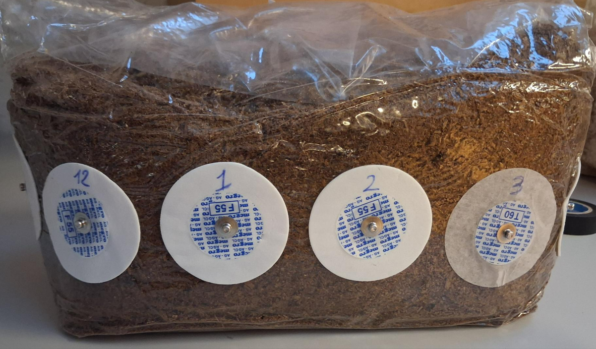
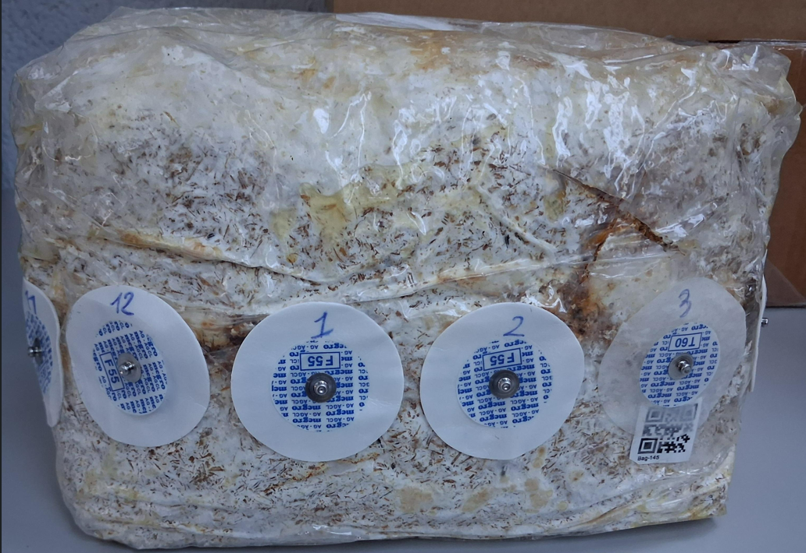
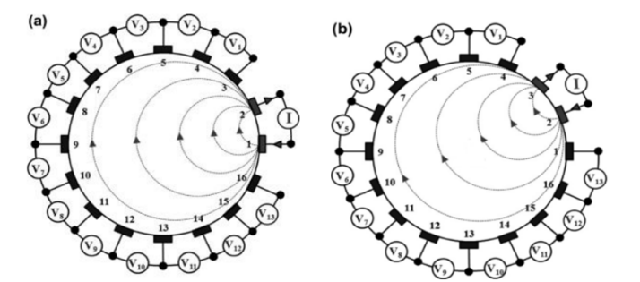
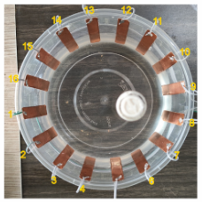

# Séance du 11 février 2026

## Contexte

et l'excel : **mesure_impedance_ech4fev**

## Remarque de ma part

- **Electrodes collées sur plastique** : Mesure très instable, car la moindre perturbation des électrodes collées sur le plastique fausse complètement la mesure.
	- Impédance dans les MOhm.
	- Peu de différence entre sac avec substrat sans mycellium et sac avec mycellium.
	- Mesure de conductivité substrat/blanc de champignon empêcher par le plastique ?

 - **Electrodes plantées dans le sac** : Mesure toujours instable. 
	- Impédance dans les kOhm.
	- Différence d'environ 2kOhm entre les mesures d'impédances dans le sac sans mycellium et avec mycellium --> Plus de conduction avec le mycellium.

- **Test de détection d'objet** : Détection d'objet conducteur planté dans le substrat avec la mesure d'impédance --> Peu concluant.

## Conclusion des mesures

- Mesures imprécises et variables.
- Impossibilité de reconstruire la tomographie d'impédance : il faut des mesures à 4 électrodes en suivant la prise de mesure détaillée sur cette image :

Cela nécessite également la librairie python pyEIT qui implémente les algorithmes nécessaires à cette reconstruction.

- Pour pouvoir tracer la tomographie d'impédance, il est impératif de fixer les électrodes fermement à un support, comme plusieurs travaux le montrent :

## A faire

- Déterminer la réponse en fréquence du substrat avec/sans mycellium --> Système RC attendu.
	- R : liée à la conductivité ionique.
	- C : liée au matériau isolant entre les électrodes (plastique).
- Le mycélium va surtout modifier la partie résistive.
- Capacité devrait être constante (plastique), mais la résistance variable.
- A chercher la fréquence du coupure (résonnance), car c'est là où il se passe des choses (sûrement entre 10Hz et 100kHz).
	- petites variations de R ou C produisent de grands changements mesurables --> endroit idéal pour être sensible à la présence du mycélium.

- Utiliser GPIB + pilote Ni-488.2 + script python pour la prise de mesure sur l'impedance analyzer 4294A.

